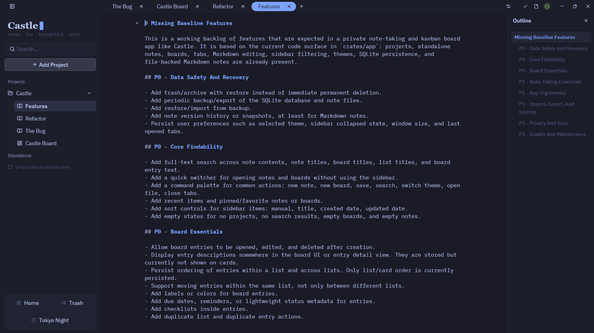
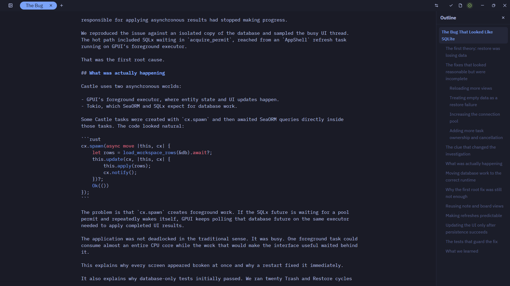
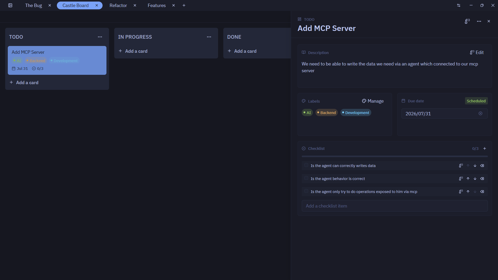

# Castle

Castle is a native note-taking and kanban board app built with Rust, [GPUI](https://www.gpui.rs/), and [GPUI Components](https://github.com/longbridge/gpui-component).

## Download

Download the latest Windows release from the repository's [Releases page](https://github.com/BeratHundurel/castle/releases/latest).

- Intel or AMD PC: choose the `windows-x86_64` file.
- Windows on ARM PC: choose the `windows-arm64` file.
- Use the `.msi` for a normal installation or the `.exe` as a standalone app.
- Standalone users can download the matching `Castle-MCP` executable for agent access; the MSI already includes it.

Windows may show a SmartScreen warning because the current release artifacts are not code-signed.

## Notes

Write focused notes with Markdown and code blocks.





## Boards

Organize work visually with kanban boards, cards, labels, checklists, and due dates.



## Agent access with MCP

Castle includes a local [Model Context Protocol](https://modelcontextprotocol.io/) server. Agents can read, search, create, update, and move notes and todos; build project/board/list hierarchies; rename workspace items; and manage todo labels, checklists, due dates, and reminders. Castle refreshes open boards and saved notes after external writes while preserving unsaved editor changes.

The Castle MSI installs the server alongside the app and registers it automatically for the installing user's Codex clients. The ChatGPT desktop app, Codex CLI, and Codex IDE extension share this MCP configuration. If one of those clients was already open during installation, restart it once so it reloads the configuration.

Standalone users can register the downloaded MCP executable manually, replacing the example path with the downloaded file's location:

```powershell
codex mcp add castle -- "C:\path\to\downloaded\Castle-MCP.exe"
```

For local development, build the server:

```powershell
cargo build --release -p castle-mcp
```

When developing Castle with the repository-local `castle.db`, pass its absolute path:

```powershell
codex mcp add castle -- C:\path\to\castle\target\release\castle-mcp.exe --database C:\path\to\castle\castle.db
```

The equivalent Codex `config.toml` entry is:

```toml
[mcp_servers.castle]
command = "C:\\path\\to\\castle\\target\\release\\castle-mcp.exe"
args = ["--database", "C:\\path\\to\\castle\\castle.db"]
```

Restart the MCP client after adding the server. You can then ask an agent things like:

- “Create a project called Launch, add a Roadmap board with Todo, Doing, and Done lists, then add these tasks…”
- “Find the Castle todo about the release notes, do the work, and move it to Done.”
- “Show me all Castle todos mentioning authentication.”
- “Create a note in Launch called Release brief, then add this Markdown outline.”
- “Find my onboarding note, update its checklist section, and move it to the Work project.”
- “Add a QA checklist and a reminder to the release todo, then mark the first check complete.”

This is a trusted local stdio server with direct access to the selected Castle database. Do not expose it over a network or configure it for agents you do not trust. It intentionally has no delete tools.

## Run locally

Castle is currently developed for Windows. Install the Rust toolchain, then run:

```sh
cargo run
```

Maintainers can publish a new version by following [RELEASING.md](RELEASING.md).
